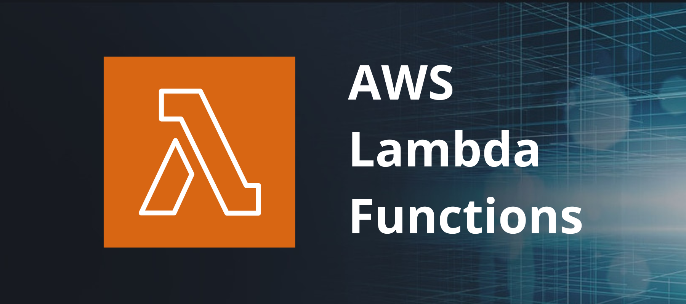

# Lambda Functions

This repository contains code samples to use in AWS Lambda.

## About AWS Lambda

[AWS Lambda](https://aws.amazon.com/lambda/?nc1=h_ls) is a serverless, event-driven compute service that lets you run code for virtually any type of application or backend service without provisioning or managing servers. You can trigger Lambda from over 200 AWS services and software as a service (SaaS) applications, and only pay for what you use.

## Getting started with Lambda

To get started with Lambda, use the Lambda console to create a function. In a few minutes, you can create a function, invoke it, and then view logs and metrics. Access the documentation [here](https://docs.aws.amazon.com/lambda/latest/dg/getting-started.html).

## Functions

- [EBS - Check Volumes Snapshot](https://github.com/isaque21/lambda/tree/main/ebs-check-snapshots)
- [EC2 - Start/Stop Routines](https://github.com/isaque21/lambda/tree/main/start-stop-routines)
- [EC2 - Pricing Report](https://github.com/isaque21/lambda/tree/main/get-price)
- [EC2 - Rightsizing Report](https://github.com/isaque21/lambda/tree/main/get-recommendations)
- [RDS - Start/Stop Routine](https://github.com/isaque21/lambda/tree/main/start-stop-routines/start-stop-rds-period)